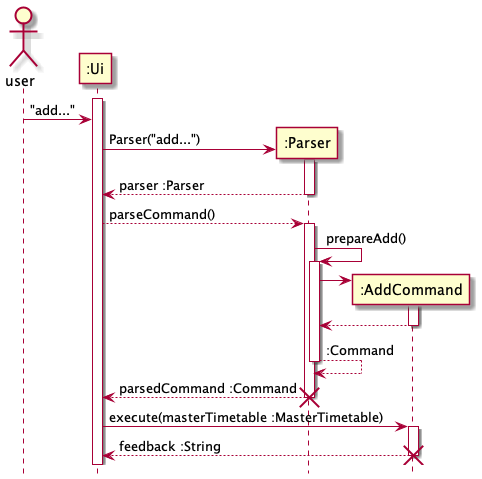
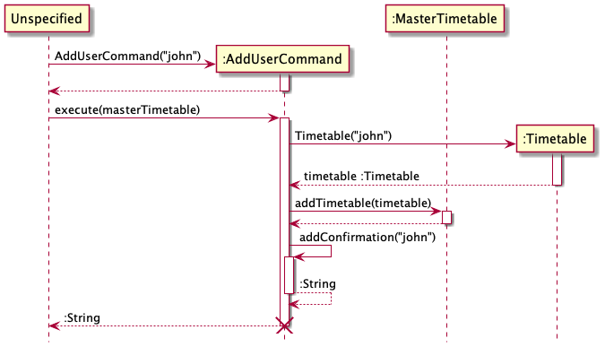
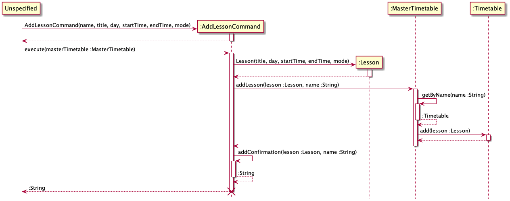
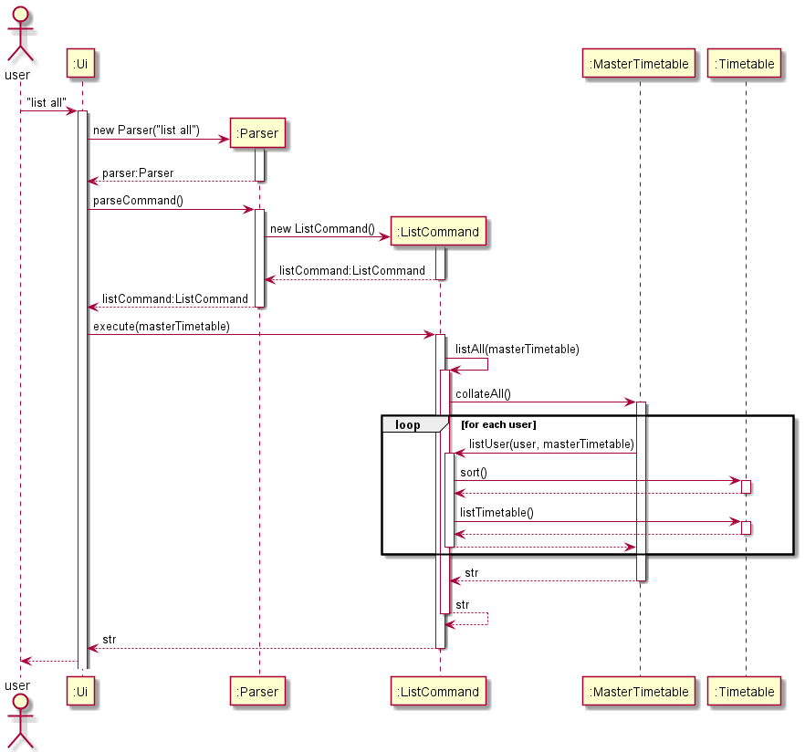
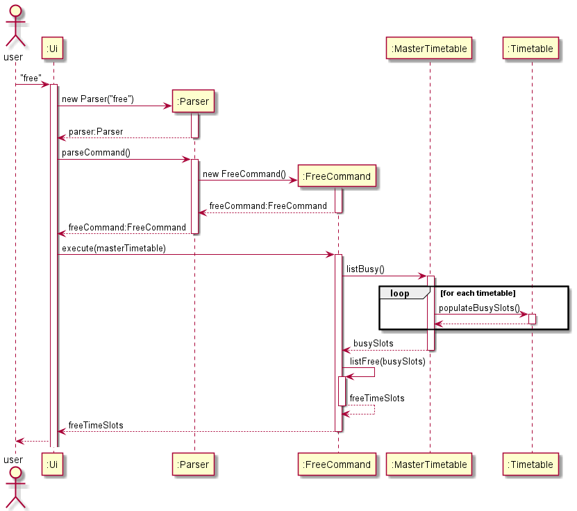
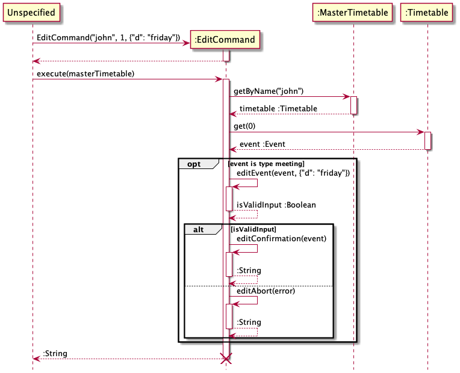

# Developer Guide

## Acknowledgements

{list here sources of all reused/adapted ideas, code, documentation, and third-party libraries -- include links to the original source as well}

# 1. Overview
MeetingJio is a program for **finding potential time slots for team meetings based on everyone’s availability**.

# 2. Design 

## 2.1 Architecture

{Describe the design and implementation of the product. Use UML diagrams and short code snippets where applicable.}

## 2.2 UI Component

## 2.3 Logic Component
- Parsers
- Commands

## 2.4 Model Component
- Timetables
- Events

## 2.5 Storage Component

# 3. Implementation
This section describes some noteworthy details on how certain features are implemented.

The following sequence diagram shows how the commands generally works.
Note that certain commands may slightly different implementation compared to the one below.

Given below is the steps on how the command operations generally works.

1. User inputs is passed to the UI.
2. Ui then provides user input to the Parser class which parses it and retrieves the command and parameters.
3. Ui subsequently executes the command on the MasterTimetable.
4. Eventually a feedback message will be shown to user upon successful or failed execution.

## 3.1 Add Feature
The `add` command is a command that allows user to 
1. add new users to the master timetable.
2. add new events to the timetables.

The following sequence diagram shows how the `add` operation generally works.

**_Note:_**

This is a condensed diagram. Several terms in the sequence diagram above have been substituted by a common term.

| Common Term | User-specific term | Lesson-specific term | Meeting-specific term      |
|-------------|-------------------|----------------------|----------------------------|
| add         | `"add_user ..."`  | `"add_lesson ..."`   | `"add_meeting ..."`|
| AddCommand  | `AddUserCommand`  | `AddLessonCommand`   | `AddMeetingCommand`|

### 3.1.1 Add User Feature
`add_user` adds new user and his or her timetable into the master timetable.

The following sequence diagram shows how the `add_user` command works:

Given below is the steps on how the `add_user` operation works.

1. User inputs add_user with username which is passed to the UI.
2. Ui then provides user input to the Parser class which parses it and retrieves the name.
3. Ui subsequently executes the command on the MasterTimetable.
4. The AddUserCommand will create a new Timetable and add it to the MasterTimetable.
5. Eventually a confirmation message will be shown to user upon successful addition.

### 3.1.2 Add Events Feature

`add_lesson` allows users to create a new lesson and add it to their own timetables.

`add_meeting` allows users to create a new meeting and add it to all the existing timetables.

**Add Lesson**

The following sequence diagram shows how the `add_lesson` operation works in detail.

Given below is the steps on how the `add_lesson` operation works.

1. User inputs add_lesson with appropriate parameters which is passed to the UI.
2. Ui then provides user input to the Parser class which parses it and retrieves the respective lesson description.
3. Ui subsequently executes the command on the MasterTimetable.
4. The AddLessonCommand will create a new Lesson and add it to the specified user's timetable.
5. Eventually a confirmation message will be shown to user upon successful addition.

**Add Meeting**

The following sequence diagram shows how the `add_meeting` operation works in detail.

The above diagram shows the sequence diagram of an addition of a meeting  which is normally after a few users 
and some of their lessons have been added and the free command is executed to see the free slots.

1. User inputs add_meeting with appropriate parameters which is passed to the UI.
2. Ui then provides user input to the Parser class which parses it and retrieves the respective meeting command.
3. Ui subsequently executes the command on the masterTimetable for the whole application.
4. The AddMeetingCommand will create a new meeting object from Meeting and will add to every user's timetable.
5. Subsequently a addMeeting confirmation message will be shown to user upon successful addition.

## 3.2 Listing Events Feature
The `list` command is a command that the user can input in order to list out the events he has in his timetable.

`list [user]` displays the timetable for the particular user.

`list all` displays the timetable for all users.

In essence, the `list all` command repeatedly calls `list [user]` for all users.

Before the timetable is listed out, it will also be sorted according to day and time for easy reading.

The following sequence diagram shows how the command `` is executed.

### 3.2.1 Listing Lessons Feature
Instead of listing all events in the timetable, the user can specify such that only lessons are listed out.

`list_lesson [user]` displays the lessons for the particular user.

`list_lesson all` displays the lessons for all users.

### 3.2.2 Listing Meetings Feature
Instead of listing all events in the timetable, the user can specify such that only meetings are listed out.

`list_meeting [user]` displays the meetings for the particular user.

`list_meeting all` displays the meetings for all users.

## 3.3 Finding Common Free Timeslots Feature
The `free` command is a command that the user can input in order to find timeslots where all users are free.

For greater customisation, `free [duration]` displays all common timeslots which has a duration longer than or equal to
what is specified.

The searching algorithm works by marking the busy slots of each timetable first.
Timings that are not marked 'busy' are then identified as free time slots.

The following sequence diagram shows how the command `free` is executed.

## 3.4 Edit events feature

The `edit` command is a command that allows users to edit a specified event.

The following sequence diagram shows how the `edit` command works:

Given below is the steps on how the `edit` operation works.

1. User inputs edit with appropriate parameters which is passed to the UI.
2. Ui then provides user input to the Parser class which parses it and retrieves the respective parameters' values.
3. Ui subsequently executes the command on the MasterTimetable.
4. The EditCommand will edit the specified event if the values provided in user input are valid.
5. Eventually a confirmation message will be shown to user upon successful edit.

## 3.5 Delete events `delete`
Deletes an event from the user's specified timetable

**Format:** ` delete n/NAME i/INDEX`

The above diagram shows the sequence diagram of a meeting deletion.

1. User inputs delete with appropriate parameters which is passed to the UI.
2. Ui then provides user input to the Parser class which parses it and retrieves the respective delete command.
3. Ui subsequently executes the command on the masterTimetable for the whole application.
4. For a normal event(non-meeting) the DeleteCommand will get the user's timetable from `MasterTimetable` 
and perform the deletion of that event.
6. If it is a meeting that the user is trying to delete, the DeleteCommand will find that meeting in 
everyone's timetable and delete it.

Example of usage:

`delete n/John i/1`

If the event is a meeting, it will delete this meeting from all users.
Else it will delete that specific lesson from the user's timetable.

The following sequence diagram shows how the `delete` command works:

Before the timetable is listed out, it will also be sorted according to day and time for easy reading.

## 3.7 Data Saving Feature

The save mechanism is facilitated by StorageFile. It creates a text file in the local machine and writes all the elements
in the MasterTimetable and Timetable to the text file in human-readable format.

Given below is the steps on how the save operation works.

Step 1: When the user exits the application. The StorageFile.saveData will be initialized.

Step 2: It will check for the existence of the data file. If the file is not found, it will create the file.
Else do nothing.

Step 3: After creating the file, collateAll method will be called to consolidate all elements in the MasterTimetable and Timetable list,
and write them into the data file.

Step 4: A message will be shown to the user, informing him that the data has been saved successfully. For any exception
encountered along the way, an error message will be shown.

The following sequence diagram shows how the save operation works:

## 3.8 Loading Data Feature

The save mechanism is facilitated by StorageFile. It reads the data specified in the local machine and stores all 
the records back into the MasterTimetable and Timetable list.

Given below is the steps on how the load operation works.

Step 1: When the user starts the application. The StorageFile.LoadData will be initialized.

Step 2: It will check for the existence of the data file. If the file is not found, do nothing.
Else it will open the file and extract the record line by line.

Step 3: If a record is a lesson type, then it will call ParserLocalData.prepareLoadLesson method.
Else if the record is a meeting type, then it will add the record into the meetingList.

Step 4: If there is no record left, the program will check if the previous record contain a meeting.
If yes, it will call for ParserLocalData.prepareLoadMeeting method to add all the meetings into the list.

The following sequence diagram shows how the load operation works:

## 3.6 Clear events `clear`
The `clear` command is a command that the user can clear a certain user's timetable or everyone's timetable.

`clear [user]` clears the timetable for the particular user.

`clear all` clears the timetable for all users.

## Product scope
### Target user profile

NUS Students who wish to meet as a group (be it for project meetings or to eat together)

### Value proposition

1. Allow a group of students to quickly identify a common time slot such that all of them are free to meet up

2. If no common time slot, allow students to see who is free at certain time slots

3. The longest time slot with the most number of available students should be suggested first, followed by either shorter time slots or time slots where lesser students are able to make it

## User Stories

| Version | As a ... | I want to ...                                    | So that I can ...                                    |
|---------|----------|--------------------------------------------------|------------------------------------------------------|
| v1.0    | new user | see usage instructions                           | refer to them when I forget the command format       |
| v1.0    | user     | add a lesson                                     | view my schedule easily                              |
| v1.0    | user     | delete a lesson                                  | modify my schedule accordingly                       |
| v1.0    | user     | view all the lessons I have in my timetable      | plan my activities accordingly                       |
| v1.0    | user     | add the location paramter to my lesson           | plan my route in advance                             |
| v1.0    | user     | add a start time and end time to my lessons      | know what time a lesson starts and ends              |
| v1.0    | user     | clear all the lessons saved in the timetable     | reset my timetable without the need to delete one by one |
| v2.0    | user     | add a new user                                   | add my friends' timetables                           |
| v2.0    | user     | see some common free slots                       | arrange a meeting                                    |
| v2.0    | user     | add a meeting                                    | block the time slot in everyone's timetables         |
| v2.0    | user     | view all the events filtered by type             | obtain a quick summary of my week                    |
| v2.0    | user     | edit a lesson                                    | update the lesson without replace it with a new one  |
| v2.0    | user     | remove a user                                    | remove the user's timetable and his or her events    |
| v2.0    | user     | save the modified timetable to the local machine | reuse it next time                                   |

## Non-Functional Requirements

{Give non-functional requirements}

## Glossary

* *glossary item* - Definition

## Instructions for manual testing

{Give instructions on how to do a manual product testing e.g., how to load sample data to be used for testing}
